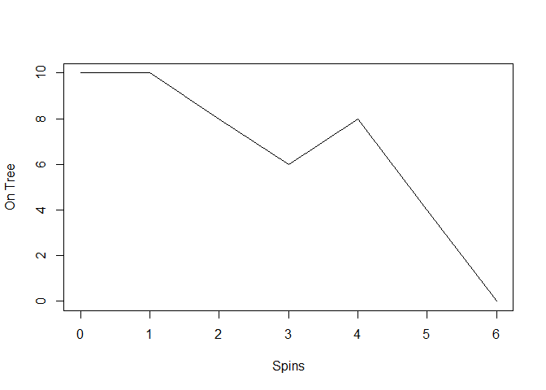

<!-- README.md is generated from README.Rmd. Please edit that file -->

# cherryr

<!-- badges: start -->
<!-- badges: end -->

The goal of cherryr is to simulates the game Hi-Ho Cherry-O.

## Installation

You can install the development version of cherryr from
[GitHub](https://github.com/) with:

``` r
# install.packages("cherryr")
pak::pak("mayaparker/cherryr")
#> 
#> ℹ No downloads are needed
#> ✔ 1 pkg: kept 1 [3.1s]
```

## Example

This is a basic example of how to play the game:

``` r
library(cherryr)

game1 <- play_game(tree = 10, max_game = 100)
game1
#> [1] 6
#> attr(,"tree")
#> [1] 10
#> attr(,"game_diff")
#> [1]  0 -2 -2  2 -4 -4
#> attr(,"class")
#> [1] "cherry"
```

A plot of a game of Hi-Ho Cherry-O over time:



In that case, don’t forget to commit and push the resulting figure
files, so they display on GitHub and CRAN.
